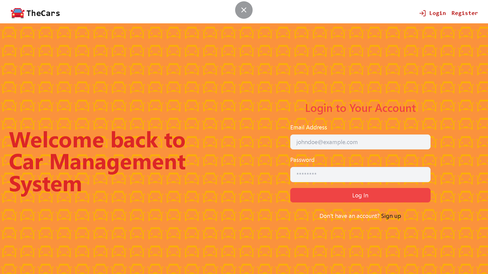
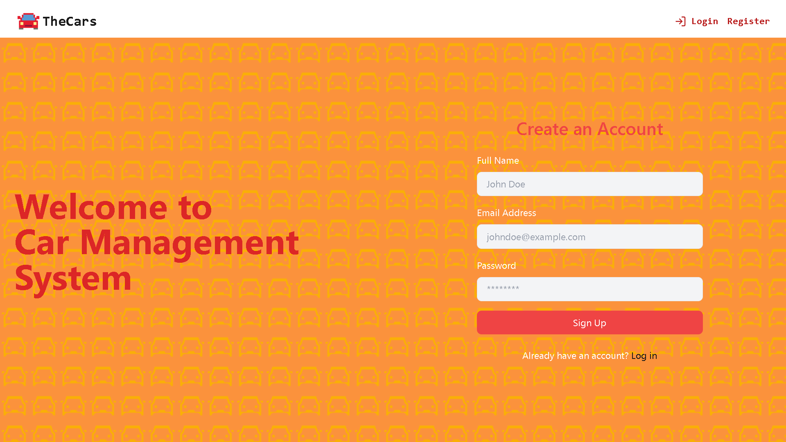
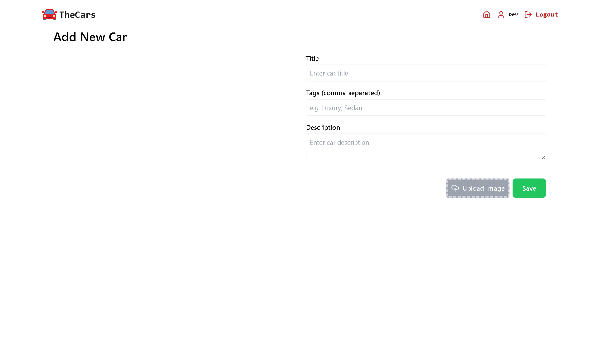
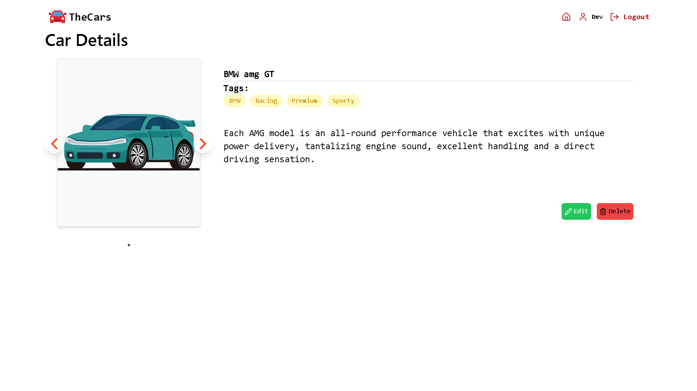
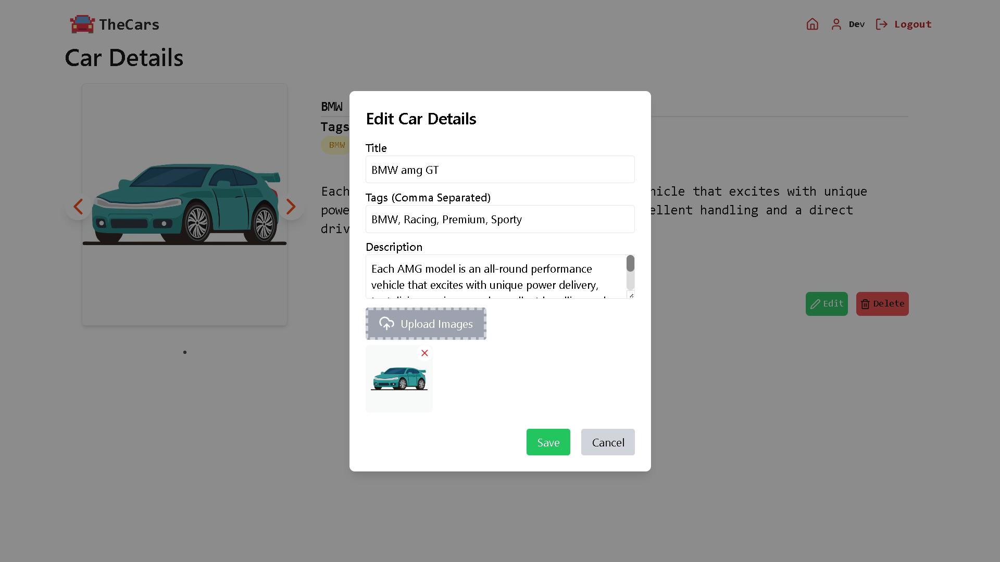
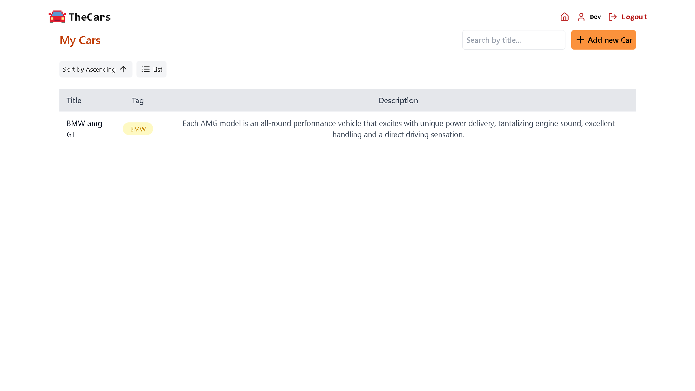
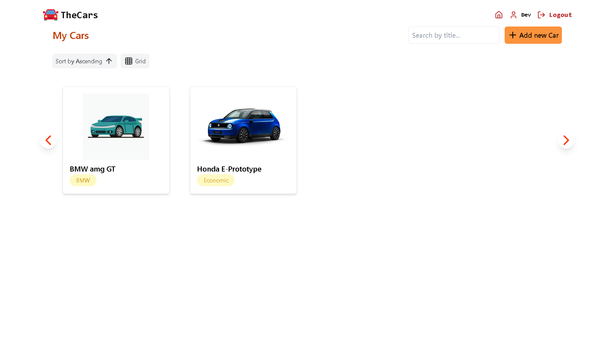
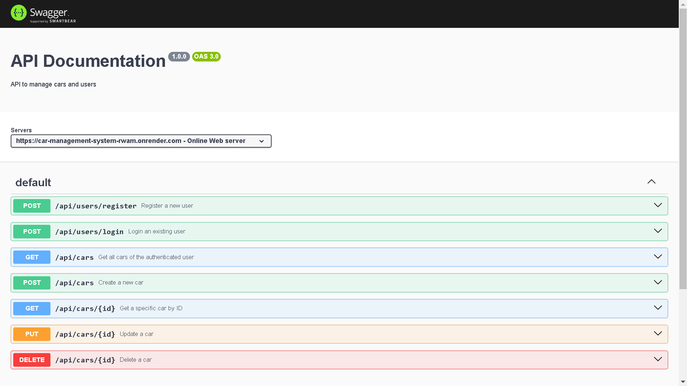

# Car Management System 🚗

## Overview

The Car Management System is an API that allows users to perform CRUD operations on car details, including tags, images, descriptions, and titles. Users can also manage their profiles and authentication.

# Car Management System Pages

## 1. Login Page
### Description
The Login page allows users to authenticate by entering their email and password. A link to the Signup page is also provided for new users.



---

## 2. Signup Page
### Description
The Signup page enables new users to create an account by providing their username, email, and password.



---

## 3. New Product Add Page
### Description
The New Product Add page allows users to input details for a new car, including title, description, tags, and images.



---

## 4. Product Page
### Description
The Product Page displays detailed information about a specific car, including its title, description, tags, and images & Edit/Delete existing car details.





---

## 5. List/Grid View Car Page
### Description
The List/Grid View Car Page shows all available cars in either a grid or list format, providing links to individual Product Pages.





---

## 5. Swagger API Documentation
### Description
The Swagger API Docs page provides a comprehensive overview of the API endpoints available in the Car Management System.



---


## API Endpoints

### Users

- **Create User**  
  `POST /api/users`  
  Create a new user.

- **Get User**  
  `GET /api/users/:id`  
  Retrieve user details by ID.

- **Update User**  
  `PUT /api/users/:id`  
  Update user details by ID.

- **Delete User**  
  `DELETE /api/users/:id`  
  Remove a user by ID.

### Cars

- **Create Car**  
  `POST /api/cars`  
  Add a new car.

- **Get All Cars**  
  `GET /api/cars`  
  Retrieve a list of all cars.

- **Get Car by ID**  
  `GET /api/cars/:id`  
  Retrieve car details by ID.

- **Update Car**  
  `PUT /api/cars/:id`  
  Update car details by ID.

- **Delete Car**  
  `DELETE /api/cars/:id`  
  Remove a car by ID.

## .env

### Frontend
```
VITE_API_URL=

```

### Backend

```
PORT=
MONGO_URL=
ACCESS_TOKEN_SECRET=
FRONTEND_API=

```

## Cloudinary

To manage images in your Car Management System, use Cloudinary to upload images and store their URLs as strings.

